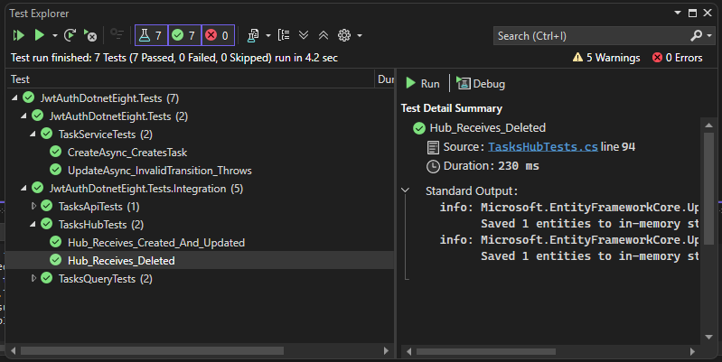

# Task Management

Full‑stack Task Management System:
- Backend: ASP.NET Core 8 (Web API, EF Core, JWT auth, SignalR)
- Frontend: React (Vite + TypeScript + Tailwind)
- [Demo](https://drive.google.com/file/d/1j5p2QaAMOS86OGBATjCQ9LiAFiqQWVM-/view?usp=drive_link)

## Backend

Key endpoints
- POST /api/auth/register
- POST /api/auth/login
- GET /api/users
- GET /api/tasks?status=&assignee=&search=
- POST /api/tasks
- PUT /api/tasks/{id}
- DELETE /api/tasks/{id}

Seed data
- admin@example.com / password (Admin)
- user@example.com / password (User)
- When system uses InMemory database - sample tasks

Notes
- Set AppSettings:Token in appsettings.json for JWT.

### Configuration

- Port: http://localhost:5099 (see Properties/launchSettings.json)
- Database: InMemory by default (Extensions/DatabaseExtensions.cs). To use SQL Server, set `UseInMemory=false` and provide `ConnectionStrings:DevDB` in appsettings.json.
- JWT Secret: set `AppSettings:Token` in appsettings.json or as an environment variable.

## Frontend

- Dev server: Vite (typically http://localhost:5173)
- Env: set `VITE_API_BASE=http://localhost:5099` and `VITE_SIGNALR_HUB=/hub/tasks` if needed
- Features: Login/Register, task board with DnD, filters (status/assignee/search), create/edit/delete, realtime updates via SignalR, form validation via react-hook-form + zod, lazy‑loaded routes and modals, toasts and confirm dialog.

## Run it

1) API
   - From repo root:
     - dotnet run --launch-profile http
   - Swagger: http://localhost:5099/swagger/index.html

2) Client
   - cd client
   - npm ci
   - npm run dev

## Tests

- Unit tests (services) and integration tests (API CRUD, filters, and SignalR hub events):
  - From repo root: dotnet test



## Compliance and Originality

- No pre built task templates were used. The board UI, controllers, services, middleware, and tests were authored for this assignment.
- No code was copied from tutorials; only the bare Vite scaffold was used to create a React app shell.
- Dependencies are minimal and justified:
  - react, react-dom, react-router-dom: core UI and routing
  - axios: HTTP client
  - @reduxjs/toolkit, react-redux: small auth state and app state
  - @microsoft/signalr: realtime updates
  - @hello-pangea/dnd: drag-and-drop on the board
  - tailwindcss (+ @tailwindcss/postcss, autoprefixer): styling
  - react-hook-form, zod: lightweight forms and validation

### Design choices

- DTO projection at controller boundary: avoids JSON reference cycles and decouples API shape from EF entities; also aligns with SignalR event payloads.
- System.Text.Json with IgnoreCycles + string enums: stable, camelCase, readable payloads.
- SignalR payload normalization: hub events use the same flat shape as HTTP responses for easy client reuse.
- Upsert on create (client): prevents duplicates when both POST response and hub event arrive.
- Drag and drop via @hello-pangea/dnd: small, actively maintained DnD library focused on React.
- Forms via react-hook-form + zod: minimal runtime and strong typed validation without heavy dependencies.
- Lazy-loaded routes and modals: reduces initial bundle and improves perceived performance.
- Toasts + confirm dialog: consistent UX feedback without third-party UI kits.
- Auth timer scheduling in App shell: avoids side effects in reducers; single place to manage auto-logout.

## Reset to seed data

Seeding runs in `Extensions/DatabaseExtensions.SeedDatabase()`.

- InMemory (default in Development): restart the API; the in-memory store is new each run and seeds automatically.
- SQL Server (persistent): set `UseInMemory=false` and ensure `ConnectionStrings:DevDB` is valid. To reseed:
  - Drop the database (e.g., `AuthDB`) and restart the API, or
  - Delete data in order (Tasks -> UserRoles -> Users -> Roles) so `Users` becomes empty, then restart the API.

## Troubleshooting

Client dev server (Vite) fails to start
- Ensure Node 18+ is installed. Run `node -v`.
- From `client/`: run `npm ci` to install exact dependencies, then `npm run dev`.
- If port 5173 is busy, Vite will pick the next port (e.g., 5174). CORS allows common dev ports.

API fails to run
- Confirm `AppSettings:Token` is set (see appsettings.json or environment variable). The repo includes a default for development.
- If using SQL Server and migrations aren’t applied, either switch to InMemory (`UseInMemory=true`) or run EF migrations.
- Swagger URL: http://localhost:5099/swagger/index.html. If 5099 is taken, check `Properties/launchSettings.json`.

SignalR not connecting
- Verify the client env: `VITE_API_BASE` and `VITE_SIGNALR_HUB`.
- Check browser console for CORS/auth errors; ensure JWT is present when connecting.

# JWT Authentication and Authorization in .NET 8.0 Core

## Overview

This project uses JSON Web Tokens (JWT) with a custom middleware and attribute-based roles to protect API endpoints and the SignalR hub. Tokens are issued on login and include role claims; roles are enforced via a custom `[RolesAuthorize]` attribute.

## Features

- JWT token issuance on login and validation on each request
- Custom JWT authentication middleware and handler
- Role-based authorization via `[RolesAuthorize]` (User, Admin)
- Protected REST endpoints and SignalR hub (/hub/tasks)

## Key components

1) JWT token generation and validation
- Token issued by `AuthController` using `ITokenFactory` after successful login.
- Token includes username and roles; signed with `AppSettings:Token` secret.
- Validation performed by the custom JWT middleware and authentication handler configured in Program.cs.

2) Role-based authorization
- Roles: `User`, `Admin`.
- `[RolesAuthorize]` attribute on controllers/actions enforces role checks.

3) Program.cs configuration
- JSON: camelCase + string enums; reference cycles ignored.
- CORS: policy "client" for Vite dev ports.
- Services: Swagger, EF Core DB, DI, JWT auth, SignalR hub.
- Pipeline: error handling, seeding, Swagger, CORS, authentication/authorization, JWT middleware, controllers, SignalR at `/hub/tasks`.

## Endpoints (auth + protected)

Auth
- POST `/api/auth/register` → register a user (body: username, email, password, role)
- POST `/api/auth/login` → returns `{ token }`

Protected (require roles)
- GET `/api/users` → [User, Admin]
- GET `/api/tasks?status=&assignee=&search=` → [User, Admin]
- POST `/api/tasks` → [User, Admin]
- PUT `/api/tasks/{id}` → [User, Admin]
- DELETE `/api/tasks/{id}` → [Admin]

Example: login request/response

Request body
```json
{ "username": "admin@example.com", "password": "password" }
```

Response body
```json
{ "token": "<jwt>" }
```

Notes
- All JSON is camelCase; enums are strings.
- SignalR clients pass the JWT via `access_token` when connecting to `/hub/tasks`.

## Configure the environment

1) JWT secret key
- Dev secret can be set in `appsettings.json` under `AppSettings:Token`.
- Or set via environment variable (Windows PowerShell):
```powershell
setx AppSettings__Token "your-secret-key"
```
(Restart the terminal for it to take effect.)

2) Database
- Development uses InMemory by default.
- To use SQL Server, set `UseInMemory=false` and configure `ConnectionStrings:DevDB` in `appsettings.json`.
- Apply migrations only when using SQL Server:
```powershell
dotnet ef database update
```

3) Swagger
- http://localhost:5099/swagger/index.html

## Seeded users

- admin@example.com / password (Admin)
- user@example.com / password (User)

Use these to login, then call protected endpoints with `Authorization: Bearer <token>`.
